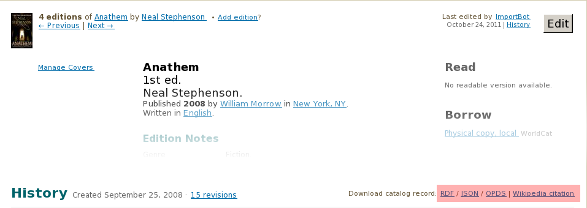

## OL Read API
	
* Used to convert identifiers into resources on Open Library.
* Can create links to borrowable or readable books on OL.
* `http://openlibrary.org/api/volumes/brief/isbn/0596156715.json` (single) or 
  `http://openlibrary.org/api/volumes/brief/json/id:1;lccn:50006784|olid:OL6179000M;lccn:55011330` (multi)
* Return matchend `items` along with status information and links.
* Can be used on a the front end using Javascript.

    <a href="http://openlibrary.org/dev/docs/api/read">http://openlibrary.org/dev/docs/api/read</a>

---

## OL Read API

* http://openlibrary.org/api/volumes/brief/isbn/0596156715.json

	      {'items':
           [{'match': 'exact',
             'status': 'full access'}],
             'itemURL': 'http://www.archive.org/stream/TheArtOfCommunity',
             'cover': {'large': 'http://covers.openlibrary.org/b/id/6223071-L.jpg',
                       'medium': 'http://covers.openlibrary.org/b/id/6223071-M.jpg',
                       'small': 'http://covers.openlibrary.org/b/id/6223071-S.jpg'},
             'fromRecord': '/books/OL23747519M',
             'ol-edition-id': 'OL23747519M',
             'ol-work-id': 'OL15328717W'}],
          'records':
            {'/books/OL23747519M':
              {'data': { ... }
               'isbns': ['0596156715',
                         '9780596156718'],
               'publishDates': ['August 2009'],
               'recordURL': 'http://openlibrary.org/books/OL23747519M'}}}

    <a href="http://openlibrary.org/dev/docs/api/read">http://openlibrary.org/dev/docs/api/read</a>

---

## OL Subjects API

* Used to get works of a subject.
* `http://openlibrary.org/subjects/world_war_2.json`
* Will return a list of works relating to World War 2. 
* Passing `?details=true` gives prominent publishers, authors etc. 
* There are few query filters (`ebooks`, `published_in`, `limit` and `offset`).

    <a href="http://openlibrary.org/dev/docs/api/subjects">http://openlibrary.org/dev/docs/api/read</a>

---

## OL Restful API

* This API is used to obtain machine readable versions of resources.
* `http://openlibrary.org/books/OL16727417M/Anathem`

    <a href="http://openlibrary.org/dev/docs/restful_api">http://openlibrary.org/dev/docs/restful_api</a>

---

## Restful API : JSON records

* `http://openlibrary.org/books/OL16727417M.json`

        {
            "key": "/books/OL16727417M", 
            "title": "Anathem", 
            "works": [
                { "key": "/works/OL14911626W" }
            ],
            "isbn_10": ["0061474096", "0061694940"], 
            "isbn_13": ["9780061474095", "9780061694943"], 
            "identifiers": {
                "goodreads": ["3268684", "2845024"], 
                "librarything": ["5116802"]
            }, ...
        }

    <a href="http://openlibrary.org/dev/docs/restful_api">http://openlibrary.org/dev/docs/restful_api</a>

---

# Koha Integration

* Open question.
* Integrate lending with Koha
* Add "read on Open Library" buttons.
* Koha installations are reliable sources of bibliographic data. 
* How to get data from Koha into Open Library?

---

# Thanks

.fx: notitle center

 
 
 
<h1 style="font-size: 50px;">Thanks!</h1>

<a href="mailto:anand@archive.org">anand@archive.org</a> 
<a href="mailto:noufal@archive.org">noufal@archive.org</a>  
<a href="http://github.com/internetarchive">http://github.com/internetarchive</a>
