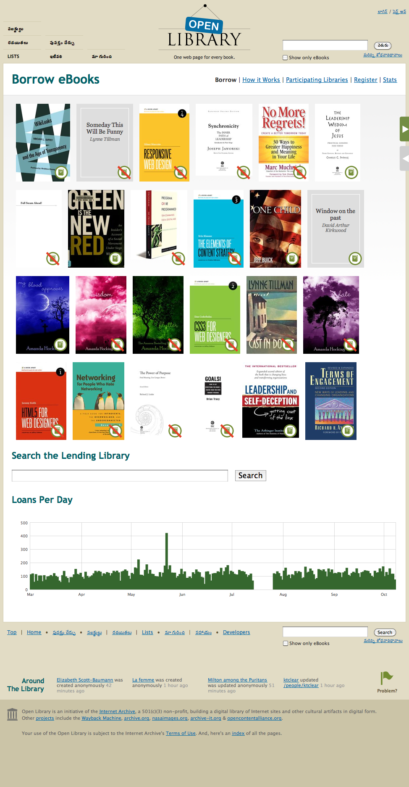
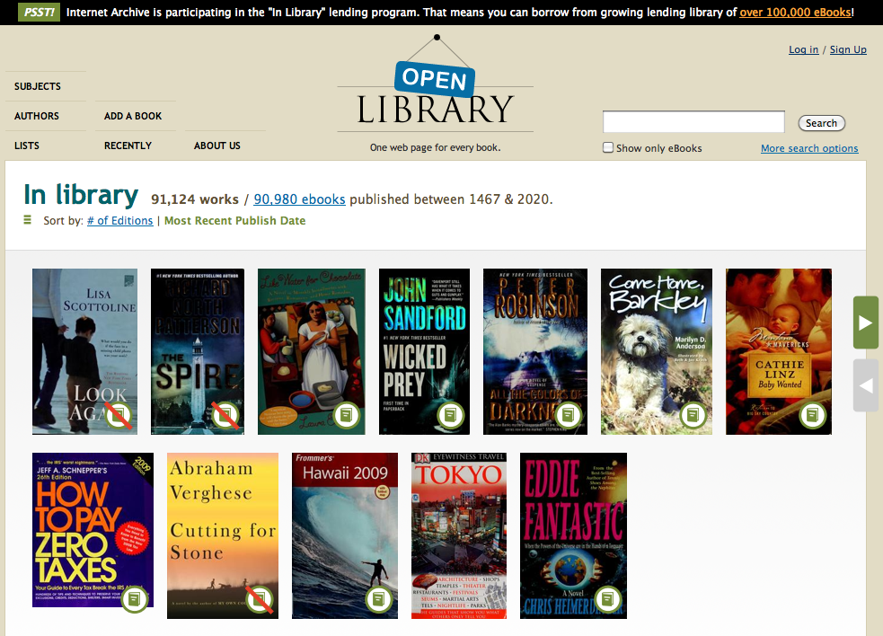
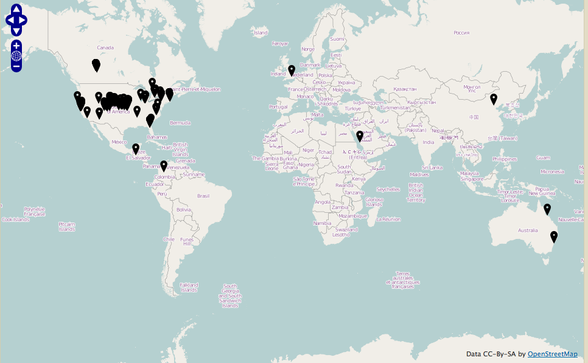
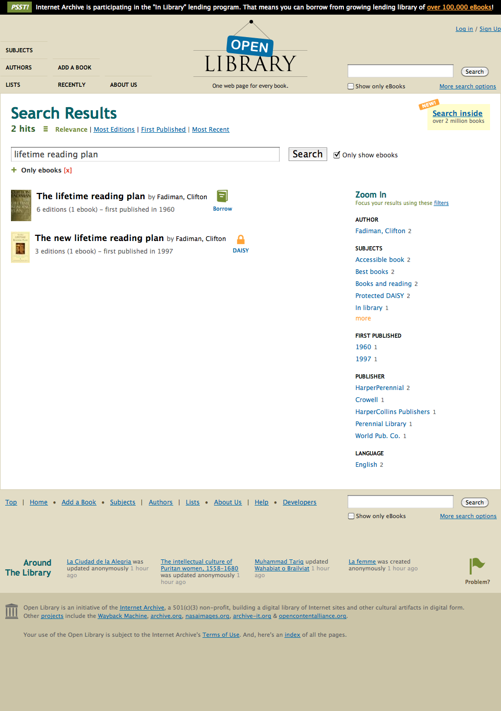
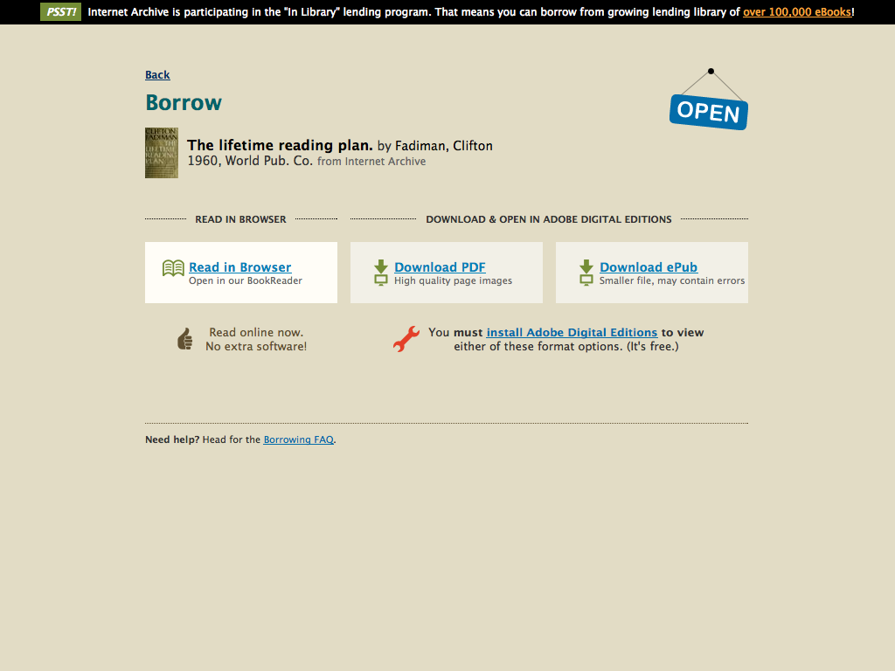
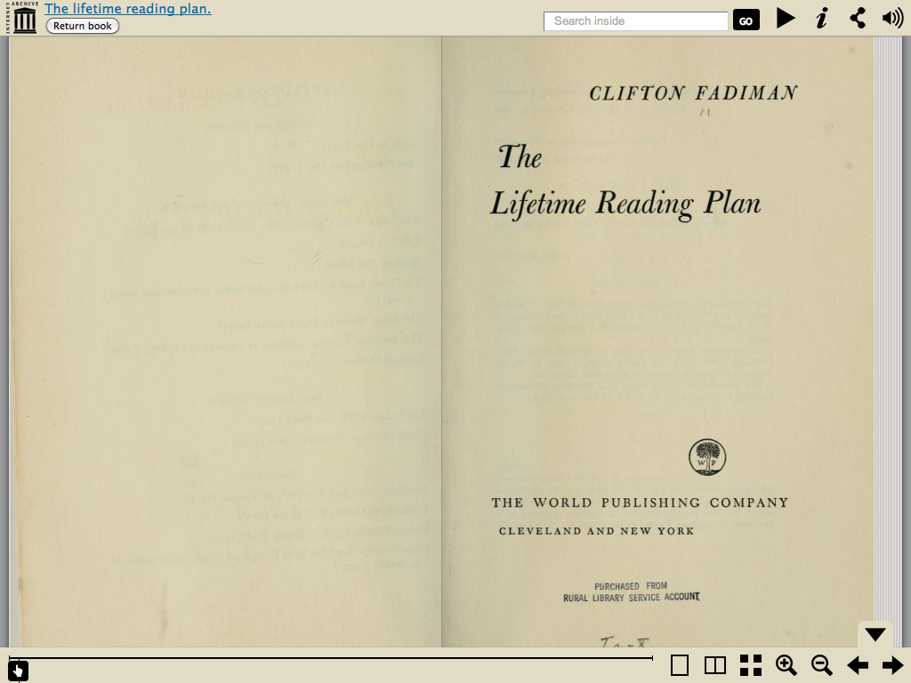
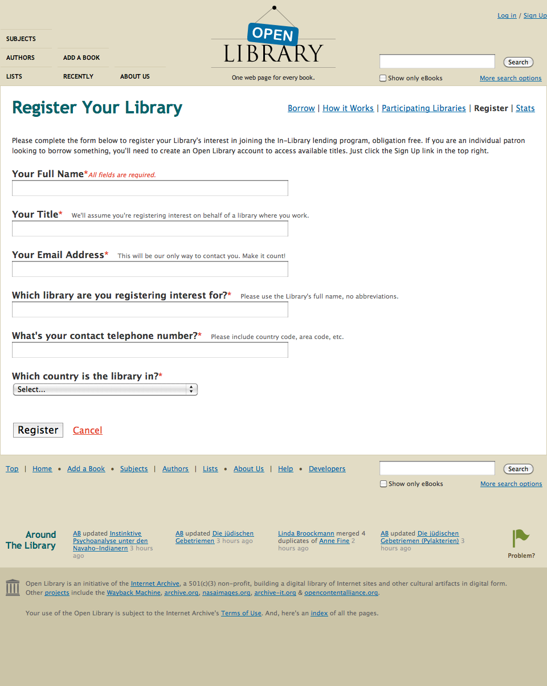

<!--
    # E-books / Search

    &nbsp;

    ---

    # E-books / Work Page

    &nbsp;

    --- 

    # E-books / Edition Page

    &nbsp;

    ---

    # E-books / Subject Page2

    &nbsp;

    ---

-->

# Lending Library

.fx: notitle

    <h3>Lending Library</h3>
    <a href="http://openlibrary.org/borrow" class="link">http://openlibrary.org/borrow</a>

---

## In Library Lending

.fx: notitle

    <h3>In Library Lending</h3>

---

## Participating Libraries

.fx: notitle

    <h3>Participating Libraries</h3>
    <a href="http://openlibrary.org/libraries" class="link">http://openlibrary.org/libraries</a>

---

## Borrow

.fx: notitle

    Borrow - Step 1

---

## Borrow

.fx: notitle

    Borrow - Step 2

---

## Borrow

.fx: notitle

    Borrow - Step 3

---

## Popular Books

.fx: notitle

---

## Interested to Join the In Library Program?

.fx: notitle

    <h3>Interested to Join the In Library Program?</h3>
    <a href="http://openlibrary.org/libraries/register">http://openlibrary.org/libraries/register</a>

