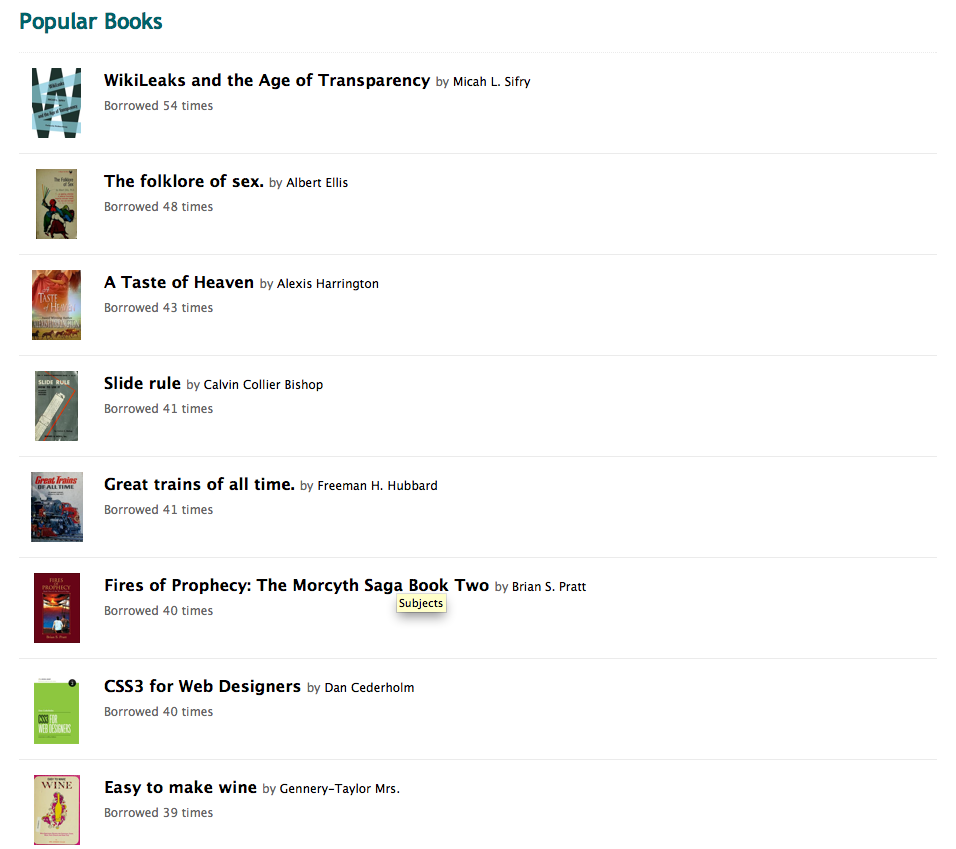

# E-books / Search

&nbsp;

---

# E-books / Work Page

&nbsp;

--- 

# E-books / Edition Page

&nbsp;

---

# E-books / Subject Page

&nbsp;

---

# Lending Library

.fx: notitle

---

# In Library Lending

.fx: notitle

---

# Participating Libraries

---

# Borrow

.fx: notitle

---

# Borrow

.fx: notitle

---

# Borrow

.fx: notitle

---

## Popular Books

.fx: notitle

