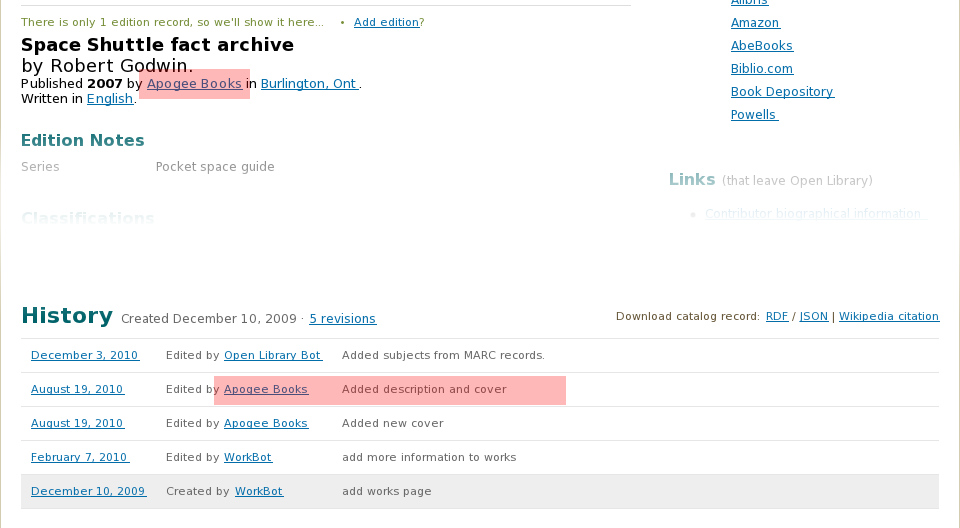

# Open Library

.fx: ol-bg

----

## A library catalogue

.fx: ol-bg center notitle

	

## A library catalogue
Image : [http://www.flickr.com/photos/16712259@N04/4467481701/](http://www.flickr.com/photos/16712259@N04/4467481701/)  Manchester Central Library (UK) by [Ricardo](http://www.flickr.com/people/16712259@N04/).

----

## Wikipedia of books

.fx: ol-bg center notitle
	
	

## A wikipedia of books

   One page for every book ever written. 
   All editable.

----

# Quick tour

.fx: ol-bg notitle center

# Welcome to Open Library
Quick tour  
Image : [http://www.flickr.com/photos/dippy_duck/466515388/](http://www.flickr.com/photos/dippy_duck/466515388/)  Detail of John Carter Brown library, Brown University by [Mr. Ducke](http://www.flickr.com/photos/dippy_duck/).
----

## Free ebooks to read

.fx: ol-bg center notitle

<image width="100%" src="images/tour/ol-home0.png"/>

## Free ebooks to read

----
  
## Lending library return cart

.fx: ol-bg center notitle

<image width="100%" src="images/tour/ol-home1.png"/>

## Lending library Return cart

----

## A community of patrons

.fx: ol-bg center notitle

<image width="100%" src="images/tour/ol-home2.png"/>

## Around the library. A community of patrons.

----

## Subjects : Extra terrestrials

.fx: ol-bg notitle

  <image width="100%" src="images/tour/subjects0.png"/>

  * Allows you to look at books published on a certain subject. 
  * e.g. "Extraterrestrial beings" [http://openlibrary.org/subjects/extraterrestrial_beings](http://openlibrary.org/subjects/extraterrestrial_beings)

  
----

## Subjects : Publishing history

.fx: ol-bg center notitle

  <image width="100%" src="images/tour/subjects1.png"/>
  
  Publishing history
  
##   
  
----

## Subjects : What, where, who and when?

.fx: ol-bg center notitle

  <image width="100%" src="images/tour/subjects2.png"/>
  
  What, where, who and when?

----

## Subjects : Authors and publishers

.fx: ol-bg center notitle
  
  <image width="100%" src="images/tour/subjects3.png"/>
  
  Authors and publishers.

----

## What can do you with subjects?

  * Find new stuff to read.
	* New authors on the same subject.
	* Related subjects.
  * Discover interesting trends. <image width="100%" src="images/tour/subjects-olympics.png"/>
    * Can you guess what subject this is?	
  * Find relevant publishers.
  * In general, a useful mine of data.

----	

## Search

.fx: center notitle

<image width="100%" src="images/tour/search.png"/>

## All records indexed and can be searched. 

----

## Search inside

.fx: center notitle

<image width="100%" src="images/tour/search-inside.png"/>

----

## History

.fx: center notitle

## History of a record

----

## Diffs

.fx: center notitle

## Viewing changes

----

## Lists

.fx: center notitle

## Lists
Adding a human angle

----

# Data in

----

## Sources of data

.fx: ol-bg

  * Open Library has many sources of data
  * Bots
  * Human beings

----

## Import bot

.fx: notitle center

## Import bot

Crawls Library of congress, Amazon, Internet Archive etc and updates our records.

----	

## Edits

.fx: center notitle

# Edits by relevant people

http://openlibrary.org/works/OL9918024W/Deep_space

----

## Add George's slides here 

 (TBD)

